# Walkthough: using the Test Adapter for Catch2

## Introduction

It can be a bit tricky to get the **Test Adapter for Catch2** running. So, if you are having trouble getting the test adapter to work you are not alone. For this Walkthrough I'm using the latest version of Microsoft Visual Studio Community 2022 (version 17.8 at the time of writing). This walkthrough makes use of the v2.0.0 release of the **Test Adapter for Catch2**. Note the Walkthroughs for [Visual Studio 2019](Walkthrough-vs2019.md) and [Visual Studio 2017](Walkthrough-vs2017.md) are still available as well, but those have not been updated to show the latest features.

I will use the ReferenceTests created for testing the **Test Adapter for Catch2**. You can find a Visual Studio solution in the [ReferenceTests](../ReferenceTests/walkthrough/) folder of this GitHub repository. I will assume you know how to open the Test Explorer Window.

The following topics are discussed.
- [Make sure the test adapter is installed](#make-sure-the-test-adapter-is-installed)
- [Select a runsettings file](#select-a-runsettings-file)
- [Trigger test discovery](#trigger-test-discovery)
  - [Configure your runsettings](#configure-your-runsettings)
  - [Solving problems with discovery](#solving-problems-with-discovery)
- [Running tests](#running-tests)
- [Jump to TEST_CASE in source](#jump-to-test_case-in-source)
- [Examples of test case detail views](#examples-of-test-case-detail-views)

## Make sure the test adapter is installed

There are several ways to install the **Test Adapter for Catch2**, but the most typical way is using the `Manage Extensions` dialog in Visual Studio. Installing via this route typically schedules the extension for installation after you shutdown Visual Studio. It is possible you missed the VSIX installer dialog that then automatically pops up, effectively resulting in the extension not being installed. I have seen this happen more than once, so don't feel bad if it happens to you.

To make sure the test adapter is installed, open the `Manage Extensions` dialog in Visual Studio and search for it in your installed extensions list.

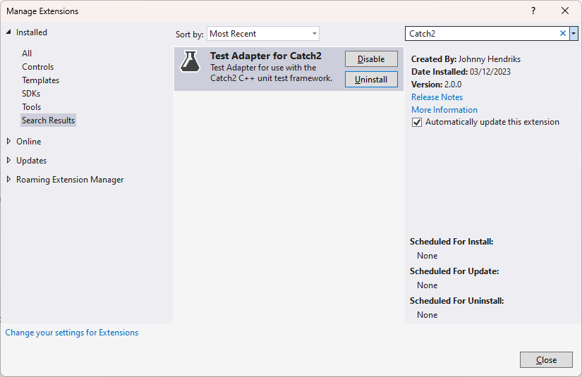

> For information on installing and managing extensions see [Microsoft Docs: Find and use Visual Studio extensions](https://docs.microsoft.com/en-us/visualstudio/ide/finding-and-using-visual-studio-extensions?view=vs-2022)

## Select a _.runsettings_ file

Out of the box the test adapter does not work. This is by design. Visual Studio provides a list of all the executables in your solution to the test adapter. As part of the discovery process these executables are called. A worst-case scenario would be that you have a project in your solution for an executable that when executed formats your C-drive. Note, the **Test Adapter for Catch2** does not directly discover Catch2 tests inside dll-files, but starting v2.0.0 a test runner can be configured that will be used to interface with such a test dll.

After you have opened the [ReferenceTests_VS2022.sln](../ReferenceTests/walkthrough) in Visual Studio 2022 and made sure the Test Explorer window is open, the first thing to do is to configure the run settings. For this walkthrough we will use the `.runsettings`, `MinimalDll.runsettings`, `MinimalExe.runsettings`, `ReferenceTests.runsettings` and `ReferenceTestsExMode.runsettings` that you can find in the [ReferenceTests walkthrough](../ReferenceTests/walkthrough) folder of this GitHub repository. The `.runsettings`-file is picked up automatically if `Auto Detect runsettings Files` is enabled. Auto detection is a global setting, and as such does not need to be configured on a per solution basis.

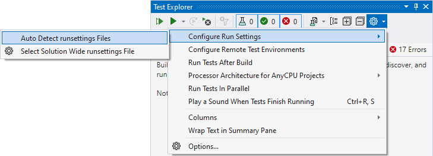

Use `Select Solution Wide runsettings File` to select other configurations. You can load multiple _.runsettings_ files and switch between them. The one with a checkmark next to it is the one that is being used. Note that clicking on a _.runsettings_ file in the `Configure Run Settings` sub-menu that has a checkmark next to it, will deselect it.

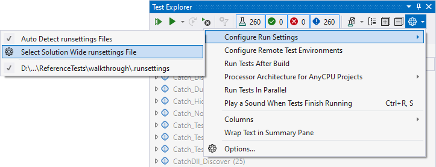

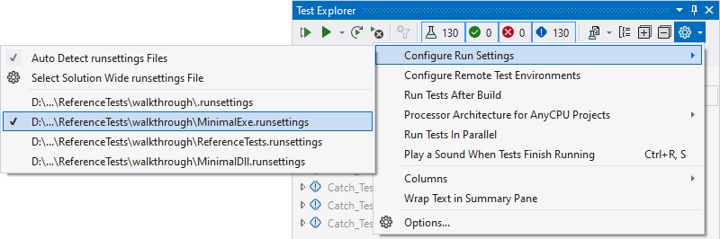

For an overview of the **Test Adapter for Catch2** specific settings that can be used in a `.runsettings`-file, see the [Settings reference](Settings.md).

## Trigger test discovery

### First build

When you have selected the `MinimalExe.runsettings` and then build the solution you will get output similar to the following in the output window (Show output for: Tests).

```
========== Starting test discovery ==========
C2A-13596: Started Catch2Adapter exe test discovery...
C2A-13596: Finished Catch2Adapter exe test discovery.
No test is available in D:\TestAdapter_Catch2\ReferenceTests\walkthrough\_unittest64\VS2022\Release\CatchDllRunner.exe. Make sure that test discoverer & executors are registered and platform & framework version settings are appropriate and try again.
C2A-33360: Catch2Adapter Dll discovery is disabled.
C2A-29180: Catch2Adapter Dll discovery is disabled.
No test is available in D:\TestAdapter_Catch2\ReferenceTests\walkthrough\_unittest64\VS2022\Release\CatchDll_Discover.dll. Make sure that test discoverer & executors are registered and platform & framework version settings are appropriate and try again.
No test is available in D:\TestAdapter_Catch2\ReferenceTests\walkthrough\_unittest64\VS2022\Release\CatchDll_Hidden.dll. Make sure that test discoverer & executors are registered and platform & framework version settings are appropriate and try again.
C2A-22332: Started Catch2Adapter exe test discovery...
C2A-12752: Started Catch2Adapter exe test discovery...
C2A-22680: Started Catch2Adapter exe test discovery...
C2A-7428: Catch2Adapter Dll discovery is disabled.
No test is available in D:\TestAdapter_Catch2\ReferenceTests\walkthrough\_unittest64\VS2022\Release\CatchDll_Testset02.dll. Make sure that test discoverer & executors are registered and platform & framework version settings are appropriate and try again.
C2A-1124: Started Catch2Adapter exe test discovery...
C2A-10256: Catch2Adapter Dll discovery is disabled.
No test is available in D:\TestAdapter_Catch2\ReferenceTests\walkthrough\_unittest64\VS2022\Release\CatchDll_Duplicates.dll. Make sure that test discoverer & executors are registered and platform & framework version settings are appropriate and try again.
C2A-17636: Catch2Adapter Dll discovery is disabled.
No test is available in D:\TestAdapter_Catch2\ReferenceTests\walkthrough\_unittest64\VS2022\Release\CatchDll_Dummy.dll. Make sure that test discoverer & executors are registered and platform & framework version settings are appropriate and try again.
C2A-16016: Started Catch2Adapter exe test discovery...
C2A-24476: Catch2Adapter Dll discovery is disabled.
C2A-39456: Started Catch2Adapter exe test discovery...
No test is available in D:\TestAdapter_Catch2\ReferenceTests\walkthrough\_unittest64\VS2022\Release\CatchDll_Testset01.dll. Make sure that test discoverer & executors are registered and platform & framework version settings are appropriate and try again.
C2A-6464: Started Catch2Adapter exe test discovery...
C2A-3116: Catch2Adapter Dll discovery is disabled.
No test is available in D:\TestAdapter_Catch2\ReferenceTests\walkthrough\_unittest64\VS2022\Release\CatchDll_Testset03.dll. Make sure that test discoverer & executors are registered and platform & framework version settings are appropriate and try again.
C2A-12752: Discover log:
  Error Occurred (exit code 255):
error: TEST_CASE( "SameTestNames. Duplicate" ) already defined.
	First seen at D:\TestAdapter_Catch2\ReferenceTests\src\tests\Catch_Duplicates\UT_SameTestNames.cpp(28)
	Redefined at D:\TestAdapter_Catch2\ReferenceTests\src\tests\Catch_Duplicates\UT_SameTestNames.cpp(42)

C2A-12752: Finished Catch2Adapter exe test discovery.
C2A-41216: Started Catch2Adapter exe test discovery...
No test is available in D:\TestAdapter_Catch2\ReferenceTests\walkthrough\_unittest64\VS2022\Release\Catch_Duplicates.exe. Make sure that test discoverer & executors are registered and platform & framework version settings are appropriate and try again.
C2A-42572: Catch2Adapter Dll discovery is disabled.
No test is available in D:\TestAdapter_Catch2\ReferenceTests\walkthrough\_unittest64\VS2022\Release\CatchDll_NoSEH.dll. Make sure that test discoverer & executors are registered and platform & framework version settings are appropriate and try again.
C2A-22332: Finished Catch2Adapter exe test discovery.
C2A-1124: Finished Catch2Adapter exe test discovery.
C2A-16016: Finished Catch2Adapter exe test discovery.
C2A-41216: Finished Catch2Adapter exe test discovery.
C2A-6464: Finished Catch2Adapter exe test discovery.
C2A-22680: Finished Catch2Adapter exe test discovery.
C2A-39456: Discover log:
  Error: Unable to reconstruct long test name
    Source: D:\TestAdapter_Catch2\ReferenceTests\walkthrough\_unittest64\VS2022\Release\Catch_Discover.exe
    Name: NotDefaultDiscoverable. a123456789b123456789c123456789d123456789e123456789&{???}f123456789b123456789g123456789d123456789h123456789&{???}i123456789b123456789j123456789k123456789l123456789
    File: D:\TestAdapter_Catch2\ReferenceTests\src\tests\Catch_Discover\UT_NotDefaultDiscoverable.cpp
    Line: 29
  Error: Unable to reconstruct long test name
    Source: D:\TestAdapter_Catch2\ReferenceTests\walkthrough\_unittest64\VS2022\Release\Catch_Discover.exe
    Name: NotDefaultDiscoverable. a123456789b123456789c123456789d123456789e123456789&{???}f123456789b123456789g123456789d123456789h123456789&{???}i123456789b123456789j123456789k123456789l123456789
    File: D:\TestAdapter_Catch2\ReferenceTests\src\tests\Catch_Discover\UT_NotDefaultDiscoverable.cpp
    Line: 34

C2A-39456: Finished Catch2Adapter exe test discovery.
========== Test discovery finished: 130 Tests found in 1.6 sec ==========
```

Well that is a bit of a mess. Test explorer changes to improve test discovery speed have as a side effect that multiple test adapter instances are run in parallel, which then also log in parallel. For this reason a unique identifier is logged before each **Test Adapter for Catch2** log-entry. This id has the format `C2A-####`, where the number is the process id of the **Test Adapter for Catch2** process. The following is the same log re-ordered and filtered for stuff only relevant for the **Test Adapter for Catch2**.

```
========== Starting test discovery ==========
C2A-33360: Catch2Adapter Dll discovery is disabled.
C2A-29180: Catch2Adapter Dll discovery is disabled.
C2A-7428: Catch2Adapter Dll discovery is disabled.
C2A-10256: Catch2Adapter Dll discovery is disabled.
C2A-17636: Catch2Adapter Dll discovery is disabled.
C2A-24476: Catch2Adapter Dll discovery is disabled.
C2A-3116: Catch2Adapter Dll discovery is disabled.
C2A-42572: Catch2Adapter Dll discovery is disabled.
C2A-13596: Started Catch2Adapter exe test discovery...
C2A-13596: Finished Catch2Adapter exe test discovery.
C2A-22332: Started Catch2Adapter exe test discovery...
C2A-22332: Finished Catch2Adapter exe test discovery.
C2A-12752: Started Catch2Adapter exe test discovery...
C2A-12752: Discover log:
  Error Occurred (exit code 255):
error: TEST_CASE( "SameTestNames. Duplicate" ) already defined.
	First seen at D:\TestAdapter_Catch2\ReferenceTests\src\tests\Catch_Duplicates\UT_SameTestNames.cpp(28)
	Redefined at D:\TestAdapter_Catch2\ReferenceTests\src\tests\Catch_Duplicates\UT_SameTestNames.cpp(42)

C2A-12752: Finished Catch2Adapter exe test discovery.
C2A-22680: Started Catch2Adapter exe test discovery...
C2A-22680: Finished Catch2Adapter exe test discovery.
C2A-1124: Started Catch2Adapter exe test discovery...
C2A-1124: Finished Catch2Adapter exe test discovery.
C2A-16016: Started Catch2Adapter exe test discovery...
C2A-16016: Finished Catch2Adapter exe test discovery.
C2A-39456: Started Catch2Adapter exe test discovery...
C2A-39456: Discover log:
  Error: Unable to reconstruct long test name
    Source: D:\TestAdapter_Catch2\ReferenceTests\walkthrough\_unittest64\VS2022\Release\Catch_Discover.exe
    Name: NotDefaultDiscoverable. a123456789b123456789c123456789d123456789e123456789&{???}f123456789b123456789g123456789d123456789h123456789&{???}i123456789b123456789j123456789k123456789l123456789
    File: D:\TestAdapter_Catch2\ReferenceTests\src\tests\Catch_Discover\UT_NotDefaultDiscoverable.cpp
    Line: 29
  Error: Unable to reconstruct long test name
    Source: D:\TestAdapter_Catch2\ReferenceTests\walkthrough\_unittest64\VS2022\Release\Catch_Discover.exe
    Name: NotDefaultDiscoverable. a123456789b123456789c123456789d123456789e123456789&{???}f123456789b123456789g123456789d123456789h123456789&{???}i123456789b123456789j123456789k123456789l123456789
    File: D:\TestAdapter_Catch2\ReferenceTests\src\tests\Catch_Discover\UT_NotDefaultDiscoverable.cpp
    Line: 34

C2A-39456: Finished Catch2Adapter exe test discovery.
C2A-6464: Started Catch2Adapter exe test discovery...
C2A-6464: Finished Catch2Adapter exe test discovery.
C2A-41216: Started Catch2Adapter exe test discovery...
C2A-41216: Finished Catch2Adapter exe test discovery.
========== Test discovery finished: 130 Tests found in 1.6 sec ==========
```

Note that `Catch_Duplicates.exe` contains tests with duplicate names, which is why those tests do not appear in the Test Explorer. The errors resulting from this are also logged.

Similarly, `Catch_Discover.exe` contains some nasty test names that cannot be discovered by default (at least not when using Catch2 v2.x). This is logged as well, and those specific tests are not shown in the Test Explorer. Other tests from the test-executable are shown however.

> Note, if you set the `<MaxCpuCount>` in the `<RunConfiguration>` section to 1, discovery will not be done in parallel. See `ReferenceTests.runsettings` for an example. Resulting output without errors would look as follows.

```
========== Starting test discovery ==========
C2A-32996: Started Catch2Adapter dll test discovery...
C2A-32996: Finished Catch2Adapter dll test discovery.
C2A-32996: Started Catch2Adapter exe test discovery...
C2A-32996: Finished Catch2Adapter exe test discovery.
========== Test discovery finished: 210 Tests found in 1.2 sec ==========
```

### Subsequent builds

This is where it can get a bit annoying. Changing or setting a _.runsettings_ file will not trigger test discovery. Due to the way the Test Explorer caches information, even building one of the test projects or reloading a solution/project will not always trigger discovery when test have already been previously discovered. The best workaround for this problem is to switch the solution configuration (_e.g._, from `Debug` to `Release`) and then trigger a build. Alternatively you can clean the solution (or test projects) (the test cases should disappear from the Test Explorer) and then build again. This is of course a major annoyance. Here having a refresh button in the Test Explorer to trigger discovery would be really helpful.

### Configure your runsettings

There are various test configurations possible. You will need to adjust the _.runsettings_ file to best deal with your situation. To help, a separate documentation page has been created with a number of the most common test configuration use cases. See [Configure runsettings (use cases)](./Runsettings.md).

For this walkthrough a few configurations have been created.

| _.runsettings_ | Description |
|:---------------|:------------|
| `.runsettings` | Auto detectable. Minimal for both exe and dll based discovery |
| `MinimalDll.runsettings` | Minimal for dll based discovery |
| `MinimalExe.runsettings` | Minimal for exe based discovery |
| `ReferenceTests.runsettings` | Custom timeout settings (exe and dll based discovery). Disabled parallel discovery. |
| `ReferenceTestsExMode.runsettings` | Uses execution mode `Single`, which is slower but runs each test case in a separate process (exe and dll based discovery). |

### Solving problems with discovery

There are many ways discovery can go wrong or provide you with unexpected results. Above you have already seen one way for the test project that contained test cases with duplicate names. But there are more ways, here are a few of the common ones. Note, output examples have been simplified by only having a single test executable project loaded.

- In case you do not have a _.runsettings_ file with `<Catch2Adapter>` settings selected you may get output similar to the following.
```
========== Starting test discovery ==========
C2A-9804: Catch2 Test Adapter Settings not found, Catch2 test discovery is cancelled. Add Catch2Adapter settings to runsettings-file.
No test is available in D:\TestAdapter_Catch2\ReferenceTests\walkthrough\_unittest64\VS2022\Debug\Catch_Discover.exe. Make sure that test discoverer & executors are registered and platform & framework version settings are appropriate and try again.
========== Test discovery finished: 0 Tests found in 364.4 ms ==========
```

- In case the **Test Adapter for Catch2** is disabled you may get output similar to the following.

```
========== Starting test discovery ==========
C2A-12060: Catch2Adapter is disabled.
No test is available in D:\TestAdapter_Catch2\ReferenceTests\walkthrough\_unittest64\VS2022\Release\Catch_Discover.exe. Make sure that test discoverer & executors are registered and platform & framework version settings are appropriate and try again.
========== Test discovery finished: 0 Tests found in 474.9 ms ==========
```

- In case you did not provide the `<FilenameFilter>` option in the _.runsettings_ file you may get output similar to the following. See explanation of this [Setting](Settings.md#filenamefilter) on how to resolve this problem. Note, a similar error is shown in case Dll discovery is disabled.

```
========== Starting test discovery ==========
C2A-9660: Catch2Adapter Exe discovery is disabled.
No test is available in D:\TestAdapter_Catch2\ReferenceTests\walkthrough\_unittest64\VS2022\Debug\Catch_Discover.exe. Make sure that test discoverer & executors are registered and platform & framework version settings are appropriate and try again.
========== Test discovery finished: 0 Tests found in 369.5 ms ==========
```

- In some cases, it is possible that test case discovery fails every now and then causing previously discovered tests to disappear from the Test Explorer. This may occur if you set the `<DiscoverTimeout>` option to a relatively short time. In this case increasing this timeout may solve your problems. See explanation of this [Setting](Settings.md#discovertimeout) for more information. Of course, setting this timeout to a very small value may also result in test case discovery to always fail. To help with this problem output similar to the following is produced when a timeout occurs.
```
========== Starting test discovery ==========
C2A-24748: Started Catch2Adapter exe test discovery...
C2A-24748: Discover log:
  Warning: Discovery timeout for D:\TestAdapter_Catch2\ReferenceTests\walkthrough\_unittest64\VS2022\Release\Catch_Discover.exe

C2A-24748: Finished Catch2Adapter exe test discovery.
No test is available in D:\TestAdapter_Catch2\ReferenceTests\walkthrough\_unittest64\VS2022\Release\Catch_Discover.exe. Make sure that test discoverer & executors are registered and platform & framework version settings are appropriate and try again.
========== Test discovery finished: 0 Tests found in 579.2 ms ==========
```

- In some cases, other test adapters may interfere with Catch2 test discovery. In those cases, look in the `Tests` output for hints. Worst case you may have to disable the test adapter that is causing trouble. For instance, if the output includes `Could not locate debug symbols`, that is probably output from the Boost Test Adapter, which can be disabled from the \[Extensions]->\[Manage Extensions] menu item. By the way, this is the reason a feature was added to the **Test Adapter for Catch2** to disable it via the _.runsettings_ file. So in case the reverse happens and the **Test Adapter for Catch2** interferes with another test adapter, you have an easy way to disable the **Test Adapter for Catch2** via the _.runsettings_ file.

### Logging level

By default Logging level is set to `Normal`. However, if you need more information you can change this setting to get more information. See explanation of this [Setting](Settings.md#logging) to see all available log levels. Below example output for discovery when Logging is set to `Verbose`

```
========== Starting test discovery ==========
C2A-24584: Started Catch2Adapter exe test discovery...
C2A-24584: Discover log:
Source: D:\TestAdapter_Catch2\ReferenceTests\walkthrough\_unittest64\VS2022\Debug\Catch_Hidden.exe
  Testcase count: 6

C2A-24584: Finished Catch2Adapter exe test discovery.
========== Test discovery finished: 6 Tests found in 414.4 ms ==========
```

## Running tests

You can of course run all tests using the `Run All Tests In View`-button in the Test Explorer. However, this may trigger a full solution build, which is not always something you may want to occur. My preference is to select the tests I want to run and use the `Run`-button to run the selected tests.

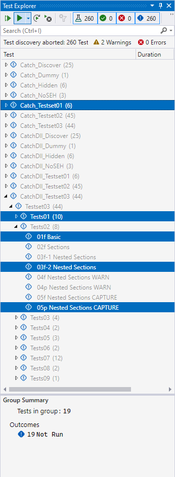 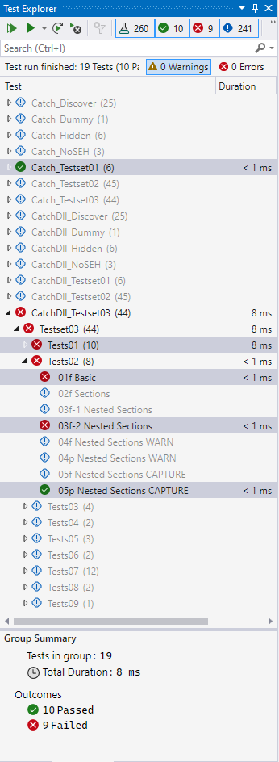

## Debugging tests

You have several options to start a debug session for a test. You can just to it the standard way, and set the project for the test executable as the default project. Configure the appropriate commandline and then start a debug session. But you can also start a debug session directly from the Test Explorer. Select the tests you want to debug (though typically you would select only one), and either use the right-click context menu, or the drop-down next to the `Run`-button. When you start a debug session via the Test Explorer you can set your own break points and/or enable the [DebugBreak feature](Settings.md#debugbreak) to help with debugging your code.

## Test case timeout

The [ReferenceTests.sln](../ReferenceTests/) contains a test ('Catch_Dummy') that will run forever. If you run this test using the `MinimalExe.runsettings` test settings the test will run until you press the Cancel button in the Test Explorer.

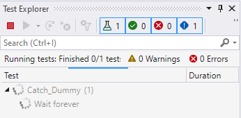

If you run this test using the `ReferenceTests.runsettings` test settings the test will be cancelled automatically after 10 milliseconds. The length of this timeout is set via the [`<TestCaseTimeout>`](Settings.md#testcasetimeout) setting in the _.runsettings_ file.

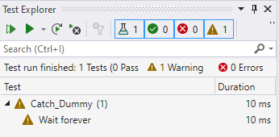

Note, the Test Explorer also has the option to set a timeout, however that one is a timeout for the test session, not for individual tests. For more information on the test session timeout see [Configure unit tests by using a _.runsettings_ file](https://docs.microsoft.com/en-us/visualstudio/test/configure-unit-tests-by-using-a-dot-runsettings-file) on [Visual Studio Docs](https://docs.microsoft.com/en-us/visualstudio/).

## Execution Mode

In older versions of the **Test Adapter for Catch2** each test case was run in a separate instantiation of the test executable. In version 1.6.0 the ability to run multiple test cases in a single instantiation was added but the default was left at the old behavior, _i.e._ the default execution mode was `Single`. Starting version 2.0.0 of the **Test Adapter for Catch2** the default execution mode is `Combine`. The advantage of this mode is that the test results can be obtained faster as the overhead of instantiating the test executable is minimized. The execution mode can be set via the [`<ExecutionMode>`](Settings.md#executionmode) setting in the _.runsettings_ file.

If you run the tests using the `ReferenceTests.runsettings` test settings you may be able to notice the difference compared to running the tests with the `ReferenceTestsExMode.runsettings` test settings.

The disadvantage of `Combine` mode is that per test assertion statistics cannot be determined.

### Forcing Single Execution mode

The nature of some tests may require them to be preferably executed in the `Single` execution mode. _E.g._, a test may be slow, or potentially run forever. To enable this you can use the [`<ExecutionModeForceSingleTagRgx>`](Settings.md#executionmodeforcesingletagrgx) setting in the _.runsettings_ file to configure Catch2 Tag-names that signal a test should always be run in `Single` execution mode.

### Timeouts

The different execution modes require different timeout logic. _E.g._, you may want tests that are run together in the `Combine` execution mode to timeout after 10s (_i.e._, all tests should be finished within 10s). However, tests that are run in `Single` execution mode may only timeout after 30s, because they are tests that are known to take a long time for example. You can set the different timeout settings using the [`<CombinedTimeout>`](Settings.md#combinedtimeout) and [`<TestCaseTimeout>`](Settings.md#testcasetimeout) setting in the _.runsettings_ file.

## Examples of test case detail views

To finish this walkthrough some screenshots of the detailed view for various test cases. Note the assertion statistics are displayed as part of the message only when the test was run in the `Single` execution mode. This is done for both Failed and Successful tests.

> See [Configure runsettings (use cases)](./Runsettings.md), for additional info about configuring mixed execution modes and playing with timeout settings.

### Link to source

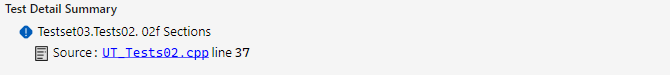

The details view will typically provide a link to the source of the test case in the detailed view of the test case. Clicking the link will bring focus to the source file and place the cursor on the line of the TEST_CASE. This link is available regardless of whether the test was run or not, as such it can be used to quickly navigate to a specific test case.

### Successful test

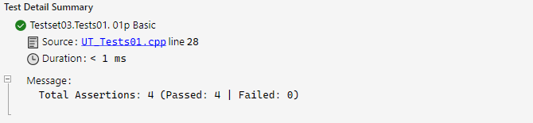

Using `ReferenceTestsExMode.runsettings` the test was run in `Single` mode. In this mode assertion statistics can be shown as a message.

### Failed test

Note the 2 StackTrace items. They provide information about the failure, and also act as links to the source of the failure. Note that only the assertion statistics are displayed as part of the message. Additional information is shown via the Standard Output. If you prefer to have the additional information be part of the message adjust the [StackTraceFormat option](Settings.md#stacktraceformat) in the _.runsettings_ file.

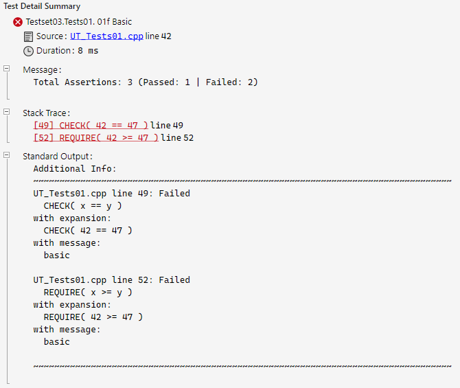

Using `ReferenceTestsExMode.runsettings` the test was run in `Single` mode. In this mode assertion statistics can be shown as a message.

A right click on the test detail summary view provides a context menu via which you could open the test log in a separate window. This might be a more convenient way to process the provided information, especially if a lot of it is shown.

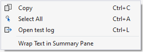

### Failed test with a failure inside a nested SECTION

Note, only the additional information provides information about sections and info messages that may help diagnose the reason for the failure. In this example the root section is named "`CHECK REQUIRE`" and the nested section with the failed test assertion is named "`CHECK_FALSE REQUIRE_FALSE`".

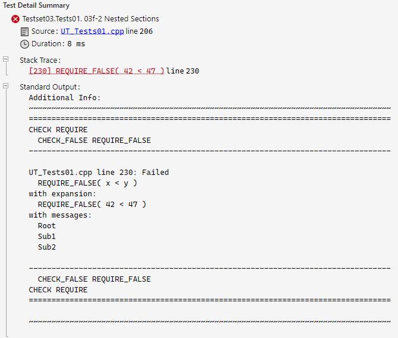

Using `ReferenceTests.runsettings` the test was run in `Combine` mode. In this mode assertion statistics cannot be determined for the test and as such no message is shown.

### Successful test with std::cout and std::cerr output

Note, in case test failures occur any additional information will be prepended to the Standard Output section.

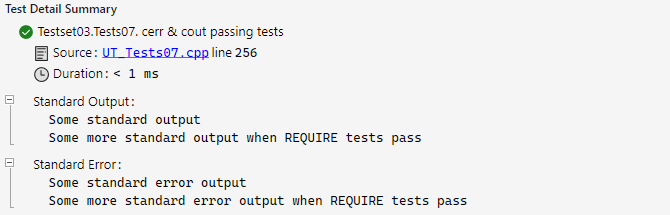

Using `ReferenceTests.runsettings` the test was run in `Combine` mode. In this mode assertion statistics cannot be determined for the test and as such no message is shown.

### Successful test with warnings

Note, some additional information, with regard to the number of warnings generated, is added to the message. See the additional information for the actual warnings.

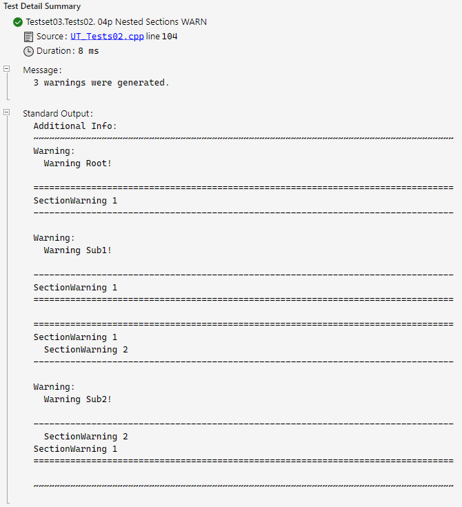

Using `ReferenceTests.runsettings` the test was run in `Combine` mode. In this mode assertion statistics cannot be determined for the test and as such are not shown as part of the message.
